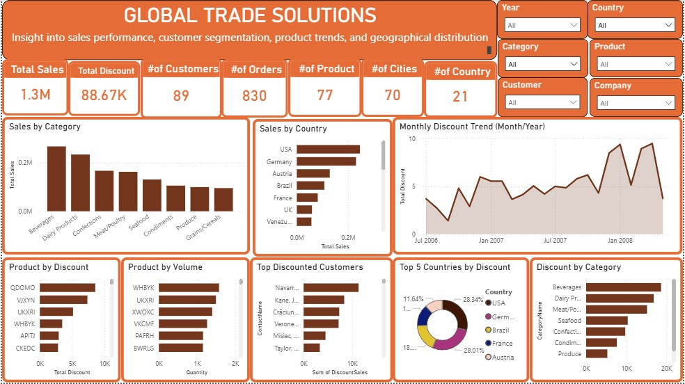

# 🌍 Global Trade Solutions — Sales Performance & Customer Analytics Dashboard

<div align="center">


**An interactive Power BI sales dashboard built for Global Trade Solutions (GTS) to surface insights across sales performance, customer segmentation, product trends, and geographic distribution — enabling data-driven decisions that drive revenue growth and customer engagement.**

</div>

---

## 📋 TABLE OF CONTENTS

- [OVERVIEW](#overview)
- [DATA SOURCE](#data-source)
- [DATA PROCESSING](#data-processing)
- [SKILLS DEMONSTRATED](#skills-demonstrated)
- [OBJECTIVES / PROBLEM STATEMENT](#objectives--problem-statement)
- [DATA ANALYSIS AND VISUALIZATION](#data-analysis-and-visualization)
- [INSIGHTS](#insights)
- [RECOMMENDATIONS](#recommendations)

---

## OVERVIEW

Global Trade Solutions (GTS) is an international trading company operating across **21 countries** spanning three continents — Europe, North America, and South America. GTS deals in a diverse product portfolio spanning multiple categories including Beverages, Dairy Products, Meat & Poultry, Seafood, Condiments, Confections, and Grains & Cereals.

Despite generating over **$1.3 million in total sales** from 830 orders across its customer base, GTS lacked a centralized, visual system to monitor sales trends, identify top-performing products and customers, and evaluate how discounting strategies were impacting revenue across different markets.

This project delivers an **interactive Power BI dashboard** that consolidates GTS's sales data into a single view — enabling management to quickly identify what is working, what is underperforming, and where strategic adjustments are needed.

| Detail | Value |
|---|---|
| **Company** | Global Trade Solutions (GTS) |
| **Total Sales** | $1.3 Million |
| **Total Orders** | 830 |
| **Total Customers** | 89 |
| **Total Products** | 77 |
| **Cities Covered** | 70 |
| **Countries Covered** | 21 |
| **Time Period** | 2006 – 2008 |
| **Tools Used** | Microsoft Excel, Microsoft Power BI, DAX |

---

## DATA SOURCE

The dataset is a structured sales transaction dataset provided for the Global Trade Solutions project. It captures order-level detail across customers, products, countries, and time periods.

### Key Data Fields

| Category | Fields |
|---|---|
| **Order Information** | Order ID, Order Date, Ship Date, Freight |
| **Customer Information** | Customer Name, Customer ID, Contact Name, Company Name |
| **Geography** | City, Country, Region, Continent |
| **Product Information** | Product ID, Product Name, Category, Unit Price, Units in Stock |
| **Sales Metrics** | Quantity Ordered, Unit Price, Discount Applied, Total Sales |

### Geographic Coverage
The dataset spans customers across **three continents**:
- 🌍 **Europe** — the most customer-diverse continent with the highest number of countries represented
- 🌎 **North America** — including the USA, the top-revenue country
- 🌎 **South America** — including Brazil and Venezuela

### Product Categories
`Beverages` · `Dairy Products` · `Meat & Poultry` · `Seafood` · `Condiments` · `Confections` · `Grains & Cereals`

### Time Coverage
Data spans **July 2006 to May 2008** — approximately 2 years of transactional history.

> **Data Quality Note:** Product names in the dataset appear as coded identifiers (e.g. QDOMO, VJXYN, WHBYK). These codes were mapped to their respective categories during the data preparation phase. This is consistent across all records and does not represent a data quality issue.

---

## DATA PROCESSING

All data preparation was performed in **Microsoft Excel** before being loaded into Power BI for visualization and DAX measure creation.

### Step 1 — Data Inspection & Validation
- Reviewed all columns for consistency, data types, and completeness
- Confirmed no duplicate Order IDs existed in the dataset
- Validated date fields were in correct date format (YYYY-MM-DD)
- Verified all sales values were positive and consistent with quantity × unit price × (1 − discount)
- Checked that all product codes mapped to a valid category

### Step 2 — Data Cleaning in Excel
- Standardised country and city name formatting (consistent casing)
- Removed any trailing whitespace from text fields using Excel's `TRIM()` function
- Verified discount values were expressed as decimals (0.05 = 5%) for consistency
- Created a clean, formatted version of the dataset as the Power BI source file

### Step 3 — Calculated Columns Added in Excel

| Calculated Field | Formula Logic | Purpose |
|---|---|---|
| `Total Sales` | `Unit Price × Quantity × (1 − Discount)` | Net revenue per order line |
| `Month-Year` | `TEXT(Order Date, "MMM YYYY")` | For monthly trend analysis |
| `Continent` | Manual lookup / categorisation | Grouping countries into continents |

### Step 4 — Data Modelling in Power BI
- Loaded cleaned Excel file into Power BI Desktop
- Set correct data types for all fields (Date, Text, Decimal, Whole Number)
- Created relationships between fact table and any supporting lookup tables
- Built a **Date Table** for time intelligence functions

### Step 5 — DAX Measures Created

```dax
-- Total Sales
Total Sales = SUM('Orders'[Total Sales])

-- Number of Orders
Number of Orders = COUNTROWS('Orders')

-- Number of Customers
Number of Customers = DISTINCTCOUNT('Orders'[Customer ID])

-- Number of Products
Number of Products = DISTINCTCOUNT('Orders'[Product ID])

-- Number of Countries
Number of Countries = DISTINCTCOUNT('Orders'[Country])

-- Number of Cities
Number of Cities = DISTINCTCOUNT('Orders'[City])

-- Number of Categories
Number of Categories = DISTINCTCOUNT('Orders'[Category])
```

### Step 6 — Slicers & Interactivity Configured
The following slicers were added to make the dashboard fully interactive:
`Year` · `Country` · `Category` · `Product` · `Customer` · `Company`

All slicers are cross-filtered, meaning selecting a value in one slicer automatically filters all visuals and all other slicers in real time.

---

## SKILLS DEMONSTRATED

| Skill | Tool | Application |
|---|---|---|
| **Data Cleaning & Validation** | Microsoft Excel | TRIM, date formatting, duplicate checks, data type correction |
| **Calculated Column Engineering** | Microsoft Excel | Total Sales formula, Month-Year field, Continent mapping |
| **Data Modelling** | Power BI | Relationships, date tables, data type configuration |
| **DAX Measure Development** | Power BI DAX | SUM, COUNTROWS, DISTINCTCOUNT, DIVIDE |
| **KPI Card Design** | Power BI | Six headline metrics for executive summary |
| **Sales Trend Analysis** | Power BI | Monthly trend line chart with time intelligence |
| **Geographic Analysis** | Power BI | Sales and discount comparison across 21 countries |
| **Customer Segmentation** | Power BI | Revenue ranking by customer and contact |
| **Product Performance Analysis** | Power BI | Ranking by sales value and by volume (quantity) |
| **Discount Strategy Analysis** | Power BI | Country-level discount mapping and impact analysis |
| **Interactive Dashboard Design** | Power BI | 6 slicers, cross-filtering, drill-down enabled |
| **Stakeholder Communication** | Power BI | Clean, labelled visuals designed for non-technical executives |

---

## OBJECTIVES / PROBLEM STATEMENT

Global Trade Solutions needed a centralized analytics solution to address four key business challenges:

### Problem 1 — No Visibility Into Sales Performance
> *GTS had no consolidated view of total sales, order volumes, or category-level performance. Management relied on raw spreadsheets to understand performance — a slow and error-prone process.*

### Problem 2 — Unclear Customer Value Distribution
> *With 89 customers across 21 countries, GTS had no way to quickly identify which customers and contacts were generating the most revenue — or which were at risk of disengagement.*

### Problem 3 — Ineffective Product Strategy
> *GTS had 77 products across 7 categories but lacked visibility into which products were selling fastest by value and by volume — making inventory and marketing decisions reactive rather than strategic.*

### Problem 4 — Discount Strategy Without Data
> *GTS was applying discounts across markets without a clear view of which countries were receiving the most discounts and whether those discounts were correlated with higher sales outcomes.*

### Analytical Questions Driving This Project

1. Which product categories generate the most sales?
2. Which countries are GTS's top and bottom revenue contributors?
3. How are discounts distributed across countries — and is discounting driving sales?
4. What is the monthly sales trend over the 2006–2008 period?
5. Which specific products sell the most by revenue and by volume?
6. Which customers and contacts contribute the most revenue to GTS?

---

## DATA ANALYSIS AND VISUALIZATION

The dashboard is structured across three analytical sections: **Sales Performance**, **Customer Segmentation**, and **Product Trends**.

---

### Dashboard Screenshot



> *Interactive Power BI dashboard — use slicers to filter by Year, Country, Category, Product, Customer, and Company*

---

### Section 1 — Sales Performance

#### KPI Cards
Six headline KPI cards sit at the top of the dashboard providing an immediate executive summary:

| KPI | Value |
|---|---|
| Total Sales | **$1.3 Million** |
| Number of Customers | **89** |
| Number of Orders | **830** |
| Number of Products | **77** |
| Number of Cities | **70** |
| Number of Countries | **21** |

---

#### Sales by Category (Bar Chart)
**Chart type used:** Vertical bar chart
**Why:** Bar charts are the most effective visual for comparing discrete categories by a single measure. Sorting bars by descending sales makes the ranking immediately readable.

**What it shows:** Revenue contribution broken down across all 7 product categories — Beverages, Dairy Products, Meat & Poultry, Seafood, Condiments, Confections, and Grains & Cereals.

**Finding:** Beverages and Dairy Products are the dominant revenue categories. Grains & Cereals sit at the bottom — a significant gap from the top performers.

---

#### Sales by Country (Horizontal Bar Chart)
**Chart type used:** Horizontal bar chart
**Why:** Horizontal bars work better for geographic comparisons with longer country name labels. Sorting by descending value immediately surfaces top markets.

**What it shows:** Revenue generated per country across all 21 markets.

**Finding:** The USA and Germany are GTS's top two revenue-generating countries by a clear margin. Poland and Norway appear at the bottom of the ranking.

---

#### Top 5 Countries by Discount (Pie / Bubble Chart)
**Chart type used:** Pie chart with percentage labels
**Why:** Proportional distribution of discounts across countries is best communicated through a part-to-whole visual. The five-country view keeps it focused and readable.

**What it shows:** Discount share distribution — France leads at 25.6%, followed by USA at 22.1%, Germany at 33.1%, Brazil at 20.5%, and Austria at 14.4%.

**Finding:** The USA and Germany receive the most discounts — which aligns with their top revenue positions. However, France receives proportionally high discounts relative to its revenue rank, warranting review.

---

#### Monthly Sales Trend (Line Chart)
**Chart type used:** Line chart
**Why:** Line charts are the standard for time-series data. The continuous line shows momentum, seasonal dips, and growth patterns more intuitively than bars for time-based data.

**What it shows:** Month-by-month total sales from July 2006 through May 2008.

**Finding:** April 2008 recorded the highest monthly sales in the entire dataset. May 2008 recorded the lowest — a sharp consecutive reversal that warrants investigation.

---

### Section 2 — Customer Segmentation

#### Customer Segmentation KPIs
| KPI | Value |
|---|---|
| Number of Countries | **21** |
| Number of Cities | **70** |
| Number of Customers | **89** |

---

#### Top Customers by Revenue (Horizontal Bar Chart)
**Chart type used:** Horizontal bar chart ranked by descending revenue
**Why:** Ranking customers by revenue value in a bar chart creates a clear, instantly scannable leaderboard. Horizontal orientation accommodates full customer names without truncation.

**What it shows:** Revenue contribution ranked by individual customer/contact name.

**Finding:** Giorgio Veronesi from Germany is GTS's highest-revenue customer contact. John Kane from Austria ranks second. Nkenge Maclin from France is the lowest-revenue contact in the top customer view.

---

### Section 3 — Product Trends

#### Products by Sales (Horizontal Bar Chart)
**Chart type used:** Horizontal bar chart
**Why:** Product names (coded identifiers) benefit from horizontal orientation for readability. Sorted descending, this immediately surfaces the highest-revenue products.

**What it shows:** Individual product performance ranked by total sales value.

**Finding:** QDOMO (a Beverage) is the highest-selling product by revenue. VJXYN (a Meat & Poultry product) ranks second.

---

#### Products by Volume (Horizontal Bar Chart)
**Chart type used:** Horizontal bar chart
**Why:** A separate volume chart (quantity sold) alongside the revenue chart reveals whether a product's high revenue comes from volume or from high unit price — a critical distinction for inventory and pricing strategy.

**What it shows:** Individual product performance ranked by total quantity sold.

**Finding:** WHBYK (a Dairy product) is the fastest-selling product by volume — it moves more units than any other product in the portfolio. AOZBW (a Meat & Poultry product) is the slowest-moving product by volume.

---

## INSIGHTS

### 💡 Insight 1 — Beverages and Dairy Lead Sales; Grains & Cereals Significantly Lag
Beverages and Dairy Products are GTS's top-performing categories. Grains & Cereals is the lowest-performing category by a notable margin. The gap suggests either low demand in this segment or insufficient market focus — both requiring different strategic responses.

### 💡 Insight 2 — Two Countries Drive Disproportionate Revenue
The USA and Germany together account for a dominant share of GTS's total revenue. The remaining 19 countries fill the rest, with Poland and Norway at the very bottom — representing underserved or structurally weak markets within GTS's current operating model.

### 💡 Insight 3 — Discounting Is Concentrated in Already-Strong Markets
The USA and Germany receive the most discounts. While discounting top markets can defend existing customer relationships, it also compresses margins in GTS's most valuable segment. Discounts in Poland and Norway are the lowest — which may partly explain their low sales performance.

### 💡 Insight 4 — April 2008 Was Peak Performance, Followed by an Immediate Trough
The sharpest revenue month (April 2008) was immediately followed by the weakest month (May 2008). This is an unusual pattern that could reflect a large one-off order in April, seasonal demand characteristics, or a supply/fulfilment disruption in May.

### 💡 Insight 5 — Revenue and Volume Rankings Tell Different Stories
QDOMO leads by sales value, but WHBYK leads by units sold. This reveals a pricing dynamic — WHBYK is a high-volume, potentially lower-margin product, while QDOMO earns its top position from higher unit value. Managing these two dimensions independently is critical for inventory and pricing decisions.

### 💡 Insight 6 — AOZBW Is the Slowest-Moving Product in the Portfolio
AOZBW, a Meat & Poultry product, records the lowest volume of any product tracked. Low velocity in a perishable-adjacent category has both revenue and cost implications — unsold stock in this category is likely incurring holding or wastage costs.

### 💡 Insight 7 — Europe Is the Most Customer-Diverse Continent
Despite North America having the top-revenue country (USA), Europe has the broadest customer base diversity — more countries with active customers than any other continent. This represents both a strength (market diversification) and a complexity (managing relationships across more territories).

### 💡 Insight 8 — A Single Customer Relationship Significantly Outperforms All Others
Giorgio Veronesi (Germany) generates substantially more revenue than any other individual contact. This level of customer concentration in a single contact creates revenue risk — if this relationship deteriorates, GTS faces a meaningful revenue impact.

---

## RECOMMENDATIONS

### ✅ REC 01 — Activate Poland and Norway With Targeted Discount Campaigns `URGENT`
Poland and Norway are GTS's lowest-revenue markets and currently receive the fewest discounts. A structured 6-month discount trial in these markets — mirroring the discount rates applied to Germany and USA — would test whether price incentivisation can unlock latent demand. If sales do not improve after 12 months of targeted investment, GTS should evaluate whether to exit these markets and reallocate resources.

---

### ✅ REC 02 — Discontinue or Replace XLXQF and SWNJY Beverages `HIGH PRIORITY`
XLXQF and SWNJY are the lowest-performing Beverage products by both sales value and volume. As Beverages is GTS's top-performing category overall, these underperforming SKUs are diluting the category's potential. Discontinuing these products and redirecting shelf space and supplier contracts toward higher-performing Beverage lines would improve category efficiency.

---

### ✅ REC 03 — Protect and Grow the QDOMO Product Line `HIGH PRIORITY`
QDOMO is the highest-revenue individual product in GTS's entire portfolio. Given its top position, GTS should ensure consistent stock availability, negotiate favourable supplier terms to protect margins, and consider promotional activity to maintain its market leadership. Any supply chain disruption to QDOMO carries outsized revenue risk.

---

### ✅ REC 04 — Scale Up WHBYK Given Its Market Velocity `HIGH PRIORITY`
WHBYK is the fastest-moving product by volume — more units of WHBYK are sold than any other product. High velocity signals strong customer demand. GTS should increase stock levels, secure supply chain capacity, and consider whether WHBYK can be introduced to markets where it is currently absent to drive incremental volume.

---

### ✅ REC 05 — Deprioritise AOZBW and MYNXN in the Meat & Poultry Range `MEDIUM PRIORITY`
AOZBW is the slowest-moving product in the portfolio. MYNXN is the fourth-slowest and contributes the least sales in its sub-category. Given the operational costs associated with managing slow-moving products — particularly in food categories — GTS should reduce production orders for both, consider clearance pricing to move existing stock, and evaluate discontinuation if velocity does not improve.

---

### ✅ REC 06 — Review the Discount Strategy for France `MEDIUM PRIORITY`
France receives a disproportionately high share of total discounts (25.6%) relative to its revenue rank. GTS should analyse whether this discount level is generating proportional revenue uplift or simply eroding margins without meaningful sales impact. If discounts are not driving incremental orders in France, the discount rate should be reduced and the savings redirected to lower-performing markets.

---

### ✅ REC 07 — Prioritise the Giorgio Veronesi and John Kane Relationships `ONGOING`
Giorgio Veronesi (Germany) and John Kane (Austria) are GTS's top two revenue-generating contacts. These relationships should receive dedicated account management attention — regular check-ins, priority order processing, and early access to new products. Given how much revenue is concentrated in these two contacts, any service failures here carry significant financial consequences.

---

### ✅ REC 08 — Review the April–May 2008 Revenue Reversal `PLANNING`
The sharpest monthly high (April 2008) immediately followed by the sharpest monthly low (May 2008) is an anomaly worth investigating. GTS should audit whether a large bulk order in April artificially inflated that month, or whether a fulfilment, supply, or demand issue in May caused the drop. Understanding this pattern will improve the accuracy of 2009 sales forecasting.

---

<div align="center">


*Microsoft Excel · Microsoft Power BI · DAX*

[](https://linkedin.com/in/emmanuel-essien01)
[](https://github.com/emmanuelessien-dev)

⭐ *If this project was useful, please consider starring the repository!*

</div>
