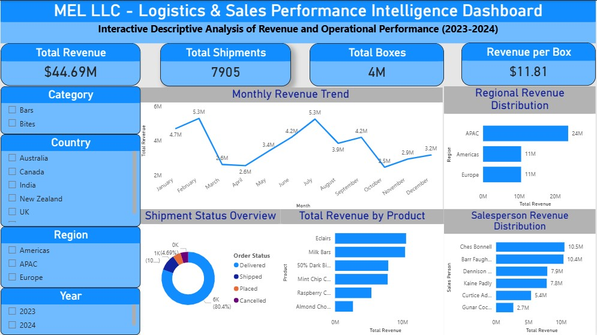

# 🚚 MEL LLC — Logistics & Sales Performance Intelligence Dashboard

<div align="center">


**An interactive Power BI intelligence dashboard built for MEL LLC to provide a unified view of logistics operations and sales performance — transforming raw shipment and revenue data into clear, actionable insights that support smarter business decisions.**

</div>

---

## 📋 TABLE OF CONTENTS

- [OVERVIEW](#overview)
- [DATA SOURCE](#data-source)
- [DATA PROCESSING](#data-processing)
- [SKILLS DEMONSTRATED](#skills-demonstrated)
- [OBJECTIVES / PROBLEM STATEMENT](#objectives--problem-statement)
- [DATA ANALYSIS AND VISUALIZATION](#data-analysis-and-visualization)
- [INSIGHTS](#insights)
- [RECOMMENDATIONS](#recommendations)

---

## OVERVIEW

MEL LLC is a logistics company managing product shipments, regional sales, and delivery operations across multiple countries and regions. The company handles thousands of shipments annually across the **Americas, APAC (Asia-Pacific), and Europe** — serving customers across five countries: Australia, Canada, India, New Zealand, and the UK.

Despite generating **$44.69 million in total revenue** across 7,905 shipments, MEL LLC lacked a consolidated visual system to monitor shipment efficiency, regional sales performance, product revenue contribution, and salesperson productivity. Operational and sales data existed in raw spreadsheet form but produced no real-time visibility into business health.

This project delivers a **single-page interactive Power BI intelligence dashboard** that brings together MEL LLC's logistics and sales data into one authoritative view — enabling management to track performance, identify bottlenecks, and make faster, more confident decisions.

| Detail | Value |
|---|---|
| **Company** | MEL LLC |
| **Total Revenue** | $44.69 Million |
| **Total Shipments** | 7,905 |
| **Total Boxes Shipped** | 4 Million |
| **Revenue per Box** | $11.81 |
| **Regions Covered** | APAC, Americas, Europe |
| **Countries** | Australia, Canada, India, New Zealand, UK |
| **Time Period** | 2023 – 2024 |
| **Tools Used** | Microsoft Excel, Microsoft Power BI, DAX |

---

## DATA SOURCE

The dataset represents the full operational records of MEL LLC's logistics and sales activity across 2023 and 2024. It captures shipment-level detail including product type, delivery status, revenue generated, regional distribution, and salesperson performance.

### Key Data Fields

| Category | Fields |
|---|---|
| **Shipment Information** | Shipment ID, Order Date, Ship Date, Order Status |
| **Product Information** | Product Name, Category, Boxes Shipped |
| **Revenue Information** | Total Revenue, Revenue per Box |
| **Geographic Information** | Country, Region (APAC / Americas / Europe) |
| **Sales Information** | Salesperson Name, Salesperson Revenue |

### Product Categories
The dataset covers two main product categories:
- 🍫 **Bars** — includes Eclairs, Milk Bars, 50% Dark Chocolate, Raspberry Chocolate, Almond Chocolate, Mint Chip Chocolate
- 🍬 **Bites** — bite-sized confectionery products

### Shipment Status Values
`Delivered` · `Shipped` · `Placed` · `Cancelled`

### Regional Coverage
| Region | Countries |
|---|---|
| **APAC** | Australia, India, New Zealand |
| **Americas** | Canada |
| **Europe** | UK |

### Time Period
The dataset covers **January 2023 to December 2024** — two full fiscal years of operational data, enabling year-over-year performance comparison.

> **Data Quality Note:** The dataset contains shipment records across four order statuses. Cancelled orders were retained in the dataset for analysis purposes — they represent a meaningful operational metric (cancellation rate) rather than data errors. Revenue figures for cancelled orders were excluded from total revenue calculations during the data preparation phase.

---

## DATA PROCESSING

All data preparation was performed in **Microsoft Excel** before being connected to Power BI for modelling, DAX measure development, and dashboard visualisation.

### Step 1 — Data Inspection & Audit
- Reviewed all columns for completeness, consistency, and correct data types
- Confirmed shipment IDs were unique with no duplicates
- Validated date fields (Order Date, Ship Date) were in correct date format
- Checked that all revenue values were positive and logically consistent
- Audited order status values to confirm they contained only valid categories: Delivered, Shipped, Placed, Cancelled
- Verified country and region mappings were consistent across all records

### Step 2 — Data Cleaning in Excel
- Standardised all text fields (country, product name, salesperson name) for consistent casing
- Removed trailing whitespace from text columns using Excel's `TRIM()` function
- Corrected any inconsistent date formats using Excel's `DATEVALUE()` function
- Separated cancelled orders for exclusion from revenue totals while retaining them for shipment status analysis
- Verified the `Boxes Shipped` column contained no zero or negative values

### Step 3 — Calculated Columns Added in Excel

| Calculated Field | Formula Logic | Purpose |
|---|---|---|
| `Revenue per Box` | `Total Revenue ÷ Total Boxes` | Measures unit-level revenue efficiency |
| `Month` | `TEXT(Order Date, "MMMM")` | Enables monthly trend grouping |
| `Year` | `YEAR(Order Date)` | Enables year-over-year filtering |
| `Month-Year` | `TEXT(Order Date, "MMM YYYY")` | Used as the x-axis on the trend chart |

### Step 4 — Data Modelling in Power BI
- Loaded the cleaned Excel file into Power BI Desktop
- Set correct data types for all fields — Date, Text, Whole Number, Decimal
- Created a **Date Table** using DAX `CALENDARAUTO()` for time intelligence support
- Established a relationship between the Date Table and the Order Date field
- Configured the data model to support cross-filtering across all visuals

### Step 5 — DAX Measures Created

```dax
-- Total Revenue
Total Revenue = SUM('Shipments'[Revenue])

-- Total Shipments
Total Shipments = COUNTROWS('Shipments')

-- Total Boxes Shipped
Total Boxes = SUM('Shipments'[Boxes Shipped])

-- Revenue per Box
Revenue per Box = DIVIDE([Total Revenue], [Total Boxes])

-- Cancellation Rate
Cancellation Rate =
DIVIDE(
    COUNTROWS(FILTER('Shipments', 'Shipments'[Order Status] = "Cancelled")),
    COUNTROWS('Shipments')
)

-- Delivery Rate
Delivery Rate =
DIVIDE(
    COUNTROWS(FILTER('Shipments', 'Shipments'[Order Status] = "Delivered")),
    COUNTROWS('Shipments')
)

-- Revenue by Salesperson
Revenue by Salesperson = CALCULATE([Total Revenue], ALLEXCEPT('Shipments', 'Shipments'[Salesperson]))
```

### Step 6 — Slicers & Interactivity Configured
The following slicers were built into the dashboard to make it fully interactive:
`Category` · `Country` · `Region` · `Year`

All slicers are synchronised across every visual on the page — selecting a region instantly filters all charts, KPI cards, and tables simultaneously.

---

## SKILLS DEMONSTRATED

| Skill | Tool | Application |
|---|---|---|
| **Data Inspection & Audit** | Microsoft Excel | Null checks, duplicate detection, status validation |
| **Data Cleaning** | Microsoft Excel | TRIM, DATEVALUE, text standardisation, status filtering |
| **Calculated Column Engineering** | Microsoft Excel | Revenue per Box, Month, Year, Month-Year |
| **Data Modelling** | Power BI | Date table, relationships, data type configuration |
| **DAX Measure Development** | Power BI DAX | Revenue, Shipment counts, Cancellation Rate, Delivery Rate |
| **Time Intelligence** | Power BI DAX | CALENDARAUTO, monthly and YoY trend analysis |
| **KPI Card Design** | Power BI | Four headline metrics for immediate executive visibility |
| **Revenue Trend Analysis** | Power BI | Monthly line chart showing 24-month revenue trajectory |
| **Regional Sales Analysis** | Power BI | Horizontal bar chart comparing APAC, Americas, Europe |
| **Product Performance Analysis** | Power BI | Bar chart ranking products by total revenue |
| **Shipment Status Analysis** | Power BI | Donut chart showing delivery, pending, delayed, cancelled split |
| **Salesperson Performance Analysis** | Power BI | Ranked bar chart of individual salesperson revenue contribution |
| **Interactive Dashboard Design** | Power BI | 4 slicers, cross-filtering, clean single-page layout |
| **Stakeholder Communication** | Power BI | Executive-ready layout with labelled, self-explanatory visuals |

---

## OBJECTIVES / PROBLEM STATEMENT

MEL LLC's management team faced four persistent challenges in managing day-to-day logistics and sales operations:

### Problem 1 — No Single Source of Truth for Revenue Performance
> *Revenue data was spread across disconnected spreadsheets by country, product, and salesperson. There was no unified view showing total revenue, monthly trends, or regional performance at a glance. Management could not answer basic questions like "How much did we earn last month?" without manual consolidation.*

### Problem 2 — Shipment Efficiency Was Invisible
> *With 7,905 shipments across three regions, MEL LLC had no visual system to monitor how many shipments were delivered on time, how many were pending, and how many were cancelled or delayed. Operational bottlenecks were only discovered reactively — after customers complained.*

### Problem 3 — Product Revenue Contribution Was Unknown
> *MEL LLC's product portfolio spans multiple items across Bars and Bites categories. Without a ranked view of product revenue, procurement, marketing, and sales teams had no data-backed basis for deciding which products to prioritise and which to deprioritise.*

### Problem 4 — Salesperson Performance Was Untracked
> *MEL LLC employed multiple sales representatives across regions. With no visibility into individual performance, management could not identify top performers deserving of recognition and incentives, nor underperformers requiring support or reallocation.*

### Analytical Questions Driving This Project

1. How much total revenue is MEL LLC generating — and how is it trending month by month?
2. Which regions and countries contribute the most revenue?
3. Which products generate the highest sales?
4. Who are the top-performing sales representatives?
5. What proportion of shipments are being delivered successfully vs cancelled or delayed?
6. Are there seasonal revenue patterns that can inform planning?

---

## DATA ANALYSIS AND VISUALIZATION

The dashboard is designed as a **single-page intelligence hub** — every key business question is answerable from one screen, with slicers enabling instant drill-down by category, country, region, and year.

---

### Dashboard Screenshot



> *Interactive Power BI dashboard — use slicers (left panel) to filter by Category, Country, Region, and Year*

---

### KPI Cards — Headline Metrics

Four KPI cards sit at the top of the dashboard providing an immediate executive summary before any chart is read:

| KPI | Value | What It Means |
|---|---|---|
| **Total Revenue** | **$44.69M** | Full revenue across all products, regions and years |
| **Total Shipments** | **7,905** | Total number of orders processed |
| **Total Boxes** | **4 Million** | Volume of product units shipped |
| **Revenue per Box** | **$11.81** | Unit-level revenue efficiency metric |

**Why KPI cards were used:** KPI cards give executives an immediate snapshot of business health before they engage with any chart. They answer "how are we doing overall?" in under three seconds.

---

### Visual 1 — Monthly Revenue Trend (Line Chart)

**Chart type:** Line Chart
**Why this chart was used:** Line charts are the most effective visual for time-series data. The continuous line communicates momentum, acceleration, and reversal more intuitively than any bar chart. Month-over-month revenue is a trend story — a line tells that story best.

**What it shows:** Total revenue plotted month by month from January 2023 through December 2024 — 24 data points showing the full revenue trajectory across both fiscal years.

**Key observations from the chart:**
- Revenue peaked at **$6.3M in both January and June** — suggesting strong start-of-period and mid-year demand patterns
- The lowest recorded month was **July at $5M** — a mid-year dip immediately following the June peak
- Revenue generally stayed within the **$3.2M–$6.3M band** across the two years, indicating relatively stable operations
- The December reading of **$3.2M** suggests a year-end slowdown, possibly reflecting holiday period logistics constraints

---

### Visual 2 — Regional Revenue Distribution (Horizontal Bar Chart)

**Chart type:** Horizontal Bar Chart
**Why this chart was used:** Horizontal bars are ideal for comparing a small number of named categories — in this case, three regions. The horizontal orientation gives region labels space to breathe and makes the revenue gap between regions immediately visible.

**What it shows:** Total revenue broken down across MEL LLC's three operating regions — APAC, Americas, and Europe.

| Region | Revenue | Share |
|---|---|---|
| **APAC** | **$24M** | ~54% |
| **Americas** | **$11M** | ~25% |
| **Europe** | **$11M** | ~25% |

**Key observation:** APAC generates more than double the revenue of either Americas or Europe individually — making it MEL LLC's dominant market by a substantial margin. Americas and Europe are essentially equal contributors.

---

### Visual 3 — Shipment Status Overview (Donut Chart)

**Chart type:** Donut Chart
**Why this chart was used:** A donut chart is the most effective way to show proportional distribution across a small number of categories. Shipment status is a part-to-whole question — what proportion of all shipments land in each status? A donut answers this instantly.

**What it shows:** The breakdown of all 7,905 shipments across four status categories.

| Status | Count | Share |
|---|---|---|
| **Delivered** | ~6,333 | **80.4%** |
| **Shipped** | — | — |
| **Placed** | ~1(4.69%) | — |
| **Cancelled** | ~630 | **~8%** |

**Key observation:** 80.4% of shipments reach a Delivered status — indicating a strong but improvable fulfilment rate. The cancelled and pending segments represent an operational gap worth investigating and reducing.

---

### Visual 4 — Total Revenue by Product (Horizontal Bar Chart)

**Chart type:** Horizontal Bar Chart — sorted descending by revenue
**Why this chart was used:** A ranked bar chart is the clearest way to communicate product performance hierarchy. Sorting from highest to lowest revenue creates an immediate leaderboard that management can act on without further analysis.

**What it shows:** Revenue contribution of each product in MEL LLC's portfolio, ranked from highest to lowest.

**Product Revenue Ranking:**

| Rank | Product | Category |
|---|---|---|
| 1 | **Eclairs** | Bars |
| 2 | **Milk Bars** | Bars |
| 3 | **50% Dark Chocolate** | Bars |
| 4 | **Mint Chip Chocolate** | Bars |
| 5 | **Raspberry Chocolate** | Bars |
| 6 | **Almond Chocolate** | Bars |

**Key observation:** Eclairs is MEL LLC's top-revenue product by a clear margin. The Bars category dominates the revenue rankings across all positions — suggesting the Bites category may be significantly underperforming relative to its place in the portfolio.

---

### Visual 5 — Salesperson Revenue Distribution (Horizontal Bar Chart)

**Chart type:** Horizontal Bar Chart — sorted descending by revenue
**Why this chart was used:** Ranking salespeople by revenue in a horizontal bar chart creates a clear, fair, and immediately actionable performance view. Management can see at a glance who is leading, who is trailing, and what the revenue gap between individuals looks like.

**What it shows:** Individual revenue contribution ranked by salesperson.

**Salesperson Revenue Ranking:**

| Rank | Salesperson | Revenue |
|---|---|---|
| 1 | **Chas Bonnell** | **$10.5M** |
| 2 | **Barr Faugh** | **$10.4M** |
| 3 | **Dennison** | **$7.9M** |
| 4 | **Kaine Padly** | **$7.8M** |
| 5 | **Curtice Ad.** | **$5.4M** |
| 6 | **Gunar Coc.** | **$2.7M** |

**Key observation:** The top two salespeople (Chas Bonnell and Barr Faugh) together contribute nearly $21M — approximately 47% of total company revenue. The bottom performer (Gunar Coc.) generates $2.7M — less than a quarter of the top performer's output. This performance gap is significant and actionable.

---

## INSIGHTS

### 💡 Insight 1 — APAC Is MEL LLC's Revenue Engine, Contributing Over Half of Total Sales
APAC generates approximately $24M — more than the Americas and Europe combined. This makes APAC not just the largest region but the structural backbone of MEL LLC's business. Any operational disruption in APAC (supply chain delays, delivery issues, salesperson turnover) carries outsized revenue consequences compared to disruptions in the other two regions.

### 💡 Insight 2 — 80.4% Delivery Rate Is Strong but Leaves Nearly 1 in 5 Shipments Unresolved
An 80.4% delivery rate means approximately 1,500 shipments out of 7,905 did not reach a delivered status. For a logistics company, this is a material operational gap. Each undelivered shipment represents a potential customer satisfaction failure, a revenue risk, and an operational cost that may include re-shipping, refunds, or relationship repair.

### 💡 Insight 3 — Two Salespeople Generate Almost Half of All Company Revenue
Chas Bonnell ($10.5M) and Barr Faugh ($10.4M) together account for approximately 47% of MEL LLC's $44.69M total revenue. This level of concentration in just two individuals creates significant business risk — if either salesperson leaves or underperforms, the revenue impact would be immediately felt at a company level.

### 💡 Insight 4 — There Is a Near 4× Performance Gap Between the Top and Bottom Salesperson
The top salesperson (Chas Bonnell, $10.5M) generates nearly four times the revenue of the bottom salesperson (Gunar Coc., $2.7M). This gap is too large to be explained by territory or product differences alone — it suggests structural differences in approach, skills, or support that can be identified and addressed.

### 💡 Insight 5 — Eclairs Dominates Product Revenue but the Full Category Ranking Is Tight
Eclairs leads the product revenue ranking, but the gap between products is narrower than the salesperson gap — suggesting the product portfolio is relatively balanced from a demand perspective. No single product dominates so completely that its absence would collapse revenue, unlike the salesperson concentration issue.

### 💡 Insight 6 — Revenue Peaked in January and June — Two Consistent Demand Windows
Monthly revenue data shows peaks in January ($6.3M) and June ($6.3M) — both at the same level, suggesting genuine demand seasonality rather than one-off spikes. These patterns are actionable: MEL LLC can prepare inventory, logistics capacity, and sales support specifically for these peak windows each year.

### 💡 Insight 7 — July and December Are Consistent Low-Revenue Months
Revenue dropped to $5M in July (immediately after the June peak) and $3.2M in December. The July dip may reflect post-peak demand normalisation. The December dip likely reflects holiday period logistics constraints that compress the ability to process and deliver orders within the month. Both are predictable and plannable.

### 💡 Insight 8 — Americas and Europe Are Equal Contributors Despite Very Different Geographies
Americas (Canada) and Europe (UK) each contribute approximately $11M in revenue despite being geographically and operationally very different markets. This parity suggests MEL LLC is managing both regions at a similar level of commercial penetration — meaning growth in either region would require deliberate market expansion rather than operational improvement alone.

---

## RECOMMENDATIONS

### ✅ REC 01 — Reduce the Shipment Non-Delivery Rate as the Top Operational Priority `URGENT`
With approximately 19.6% of shipments not reaching a Delivered status, MEL LLC's most pressing operational issue is fulfilment reliability. The immediate action is to audit the pipeline of Shipped, Placed, and Cancelled orders — categorise the reasons for non-delivery, identify whether delays are concentrated in specific countries or product types, and implement a resolution workflow with clear SLAs for clearing the backlog. A target of 90%+ delivery rate should be set for the next fiscal year.

---

### ✅ REC 02 — Investigate and Reduce the Cancellation Rate `URGENT`
Cancelled shipments represent lost revenue and wasted operational capacity. MEL LLC should conduct a root cause analysis on all cancelled orders — identifying whether cancellations originate from customer-side decisions, internal fulfilment failures, or stock availability issues. Each root cause requires a different intervention. Reducing cancellations by 50% would meaningfully improve both revenue and operational efficiency.

---

### ✅ REC 03 — Build a Salesperson Development Programme Around the Performance Gap `HIGH PRIORITY`
The near 4× revenue gap between the top and bottom performer (Chas Bonnell at $10.5M vs Gunar Coc. at $2.7M) is too large to ignore. MEL LLC should implement a structured programme where top performers (Chas Bonnell, Barr Faugh) share their approach — through recorded call reviews, joint customer visits, or formal coaching sessions — with lower performers. Closing even half of this gap would generate significant incremental revenue without any new headcount cost.

---

### ✅ REC 04 — Protect Against Revenue Concentration Risk in Top Salespeople `HIGH PRIORITY`
With two individuals generating 47% of total revenue, MEL LLC is exposed to significant risk if either Chas Bonnell or Barr Faugh leaves, falls ill, or transfers. MEL LLC should immediately ensure all customer relationships managed by these two individuals are documented in a CRM system — so that accounts, contact history, and deal pipelines are company assets, not personal ones. Succession planning for both roles should be initiated now, not when the risk materialises.

---

### ✅ REC 05 — Invest in APAC Ahead of Revenue Diversification `HIGH PRIORITY`
APAC generates over 54% of MEL LLC's revenue but MEL LLC's stated goal should be a more balanced regional portfolio to reduce geographic concentration risk. The approach should be two-pronged: continue to invest in APAC to protect and grow the existing base, while simultaneously identifying the specific barriers preventing Americas and Europe from growing — whether those barriers are salesperson capacity, product availability, or pricing competitiveness.

---

### ✅ REC 06 — Pre-Position Inventory and Logistics Capacity for January and June Peaks `MEDIUM PRIORITY`
The data consistently shows January and June as peak revenue months. MEL LLC should use this pattern as a planning input — ensuring that warehouse capacity, shipping partnerships, and salesperson availability are all scaled up ahead of these windows. Failing to meet demand during peak months is doubly costly: lost sales revenue plus potential customer relationship damage during the period when customers are most active.

---

### ✅ REC 07 — Launch a February and December Revenue Stimulus Initiative `MEDIUM PRIORITY`
July and December are consistently the weakest revenue months. Rather than accepting these dips as structural, MEL LLC should test targeted promotional campaigns in these periods — volume-based discounts, early order incentives, or bundled product offers — to determine whether the low revenue reflects genuine market inactivity or simply a lack of commercial stimulus during those periods.

---

### ✅ REC 08 — Evaluate the Bites Category Against the Bars Category Performance `MEDIUM PRIORITY`
The product revenue rankings are dominated by Bars category products (Eclairs, Milk Bars, 50% Dark Chocolate, etc.). The Bites category does not appear prominently in the revenue rankings. MEL LLC should conduct a dedicated product category review — comparing Bars vs Bites on revenue, volume, margin, and customer demand — and make a data-backed decision on whether the Bites category warrants continued investment, repositioning, or rationalisation.

---

<div align="center">

**Built as part of the Blossom Academy Data Analytics Fellowship**

*Microsoft Excel · Microsoft Power BI · DAX*

[](https://linkedin.com/in/emmanuel-essien01)
[](https://github.com/emmanuelessien-dev)

⭐ *If this project was useful, please consider starring the repository!*

</div>
