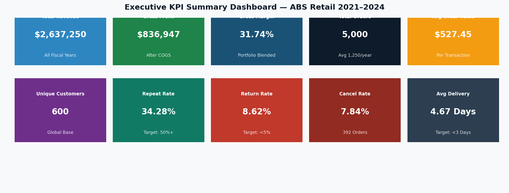
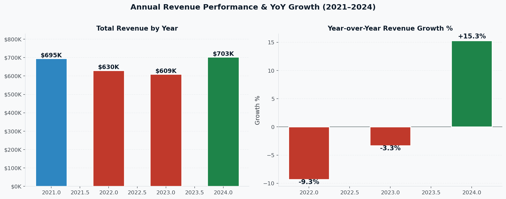
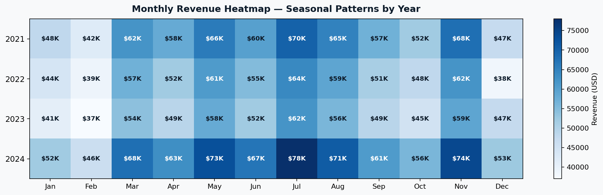
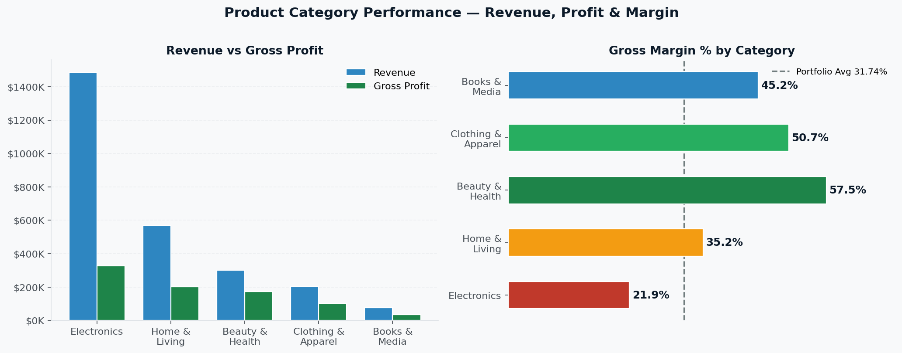
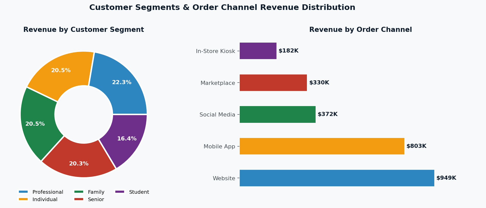
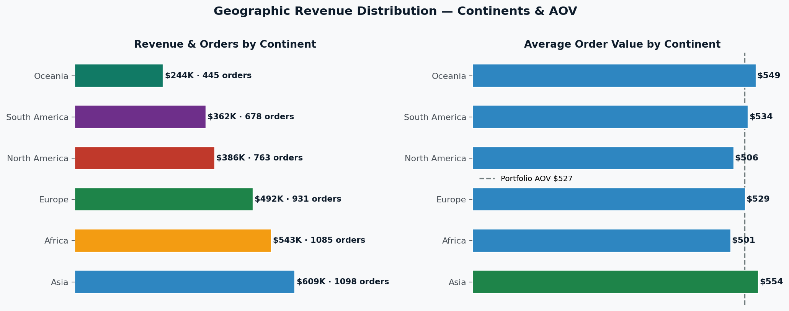
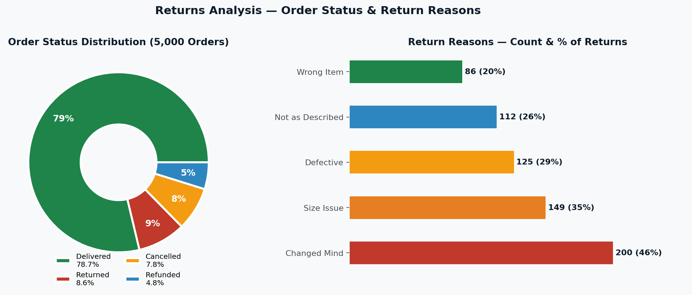
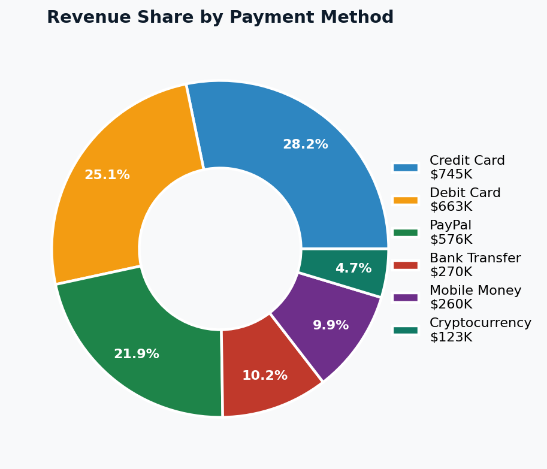
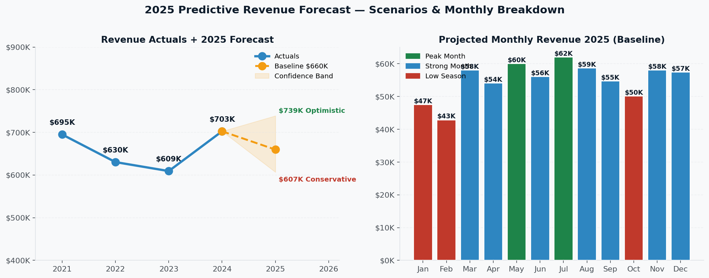

# 🛒 ABS Retail — Loans and E-Commerce Analysis

<div align="center">


</div>

---

## 📋 TABLE OF CONTENTS

- [OVERVIEW](#overview)
- [DATA SOURCE](#data-source)
- [DATA PROCESSING](#data-processing)
- [SKILLS DEMONSTRATED](#skills-demonstrated)
- [OBJECTIVES / PROBLEM STATEMENT](#objectives--problem-statement)
- [DATA ANALYSIS AND VISUALIZATION](#data-analysis-and-visualization)
- [INSIGHTS](#insights)
- [RECOMMENDATIONS](#recommendations)

---

## OVERVIEW

ABS Retail is a global e-commerce company operating across **23 countries and 6 continents**, providing customers with a platform to purchase products across five major categories — Electronics, Home & Living, Beauty & Health, Clothing & Apparel, and Books & Media — while offering multiple payment, shipping, and ordering channel options.

This project delivers a **comprehensive, end-to-end data analytics solution** for ABS Retail covering four full fiscal years (2021–2024). The analysis goes beyond surface-level reporting — it uncovers the *why* behind revenue trends, identifies high-risk operational areas costing the business over $145,000 annually, and produces a predictive 2025 revenue forecast to guide strategic planning.

The project culminates in a **6-page interactive Power BI dashboard** designed for executive stakeholders, a **16-slide professional presentation**, and a complete **Excel analysis workbook** — all built to production quality standards.

| Detail | Value |
|---|---|
| **Records Analyzed** | 5,000 transactions |
| **Unique Customers** | 600 |
| **Countries Covered** | 23 |
| **Continents** | 6 (Africa, Asia, Europe, North America, South America, Oceania) |
| **Time Period** | Fiscal Years 2021 – 2024 |
| **Total Revenue Analyzed** | $2,637,250 |
| **Tools Used** | Python, Power BI, DAX, Excel, python-pptx |

---

## DATA SOURCE

The dataset is a structured transactional retail dataset (`ABS_RETAIL.xlsx`) containing **5,000 order records** across 29 fields per transaction.

### Dataset Fields

| Category | Fields |
|---|---|
| **Identifiers** | `order_id`, `customer_id`, `product_id` |
| **Time** | `order_date`, `delivery_date`, `year` |
| **Customer** | `customer_name`, `customer_segment`, `is_repeat_customer` |
| **Geography** | `country`, `city`, `continent` |
| **Product** | `product_name`, `category`, `sub_category` |
| **Financials** | `unit_cost_usd`, `unit_price_usd`, `discount_pct`, `quantity`, `gross_revenue_usd`, `total_cost_usd`, `shipping_cost_usd` |
| **Operations** | `shipping_method`, `days_to_deliver`, `payment_method`, `order_channel`, `order_status`, `return_reason` |

### Customer Segments
`Professional` · `Individual` · `Family` · `Senior` · `Student`

### Product Categories
`Electronics` · `Home & Living` · `Beauty & Health` · `Clothing & Apparel` · `Books & Media`

### Order Channels
`Website` · `Mobile App` · `Social Media` · `Marketplace` · `In-Store Kiosk`

### Order Status Values
`Delivered` · `Returned` · `Cancelled` · `Refunded`

> **Data Quality Note:** The dataset contains zero missing values in all transactional fields. The `return_reason` field is intentionally null for orders with status other than *Returned* — this is expected behaviour, not a data quality issue. 241 refunded orders have no `return_reason` logged, representing a data collection gap flagged as an improvement opportunity.

---

## DATA PROCESSING

All data processing was performed in **Python (pandas)** and **Microsoft Excel Power Query**. The following steps were applied before any analysis was conducted:

### Step 1 — Data Loading & Type Casting
```python
import pandas as pd

df = pd.read_excel("ABS_RETAIL.xlsx")
df['order_date']    = pd.to_datetime(df['order_date'])
df['delivery_date'] = pd.to_datetime(df['delivery_date'])
```

### Step 2 — Data Validation
- Checked for duplicate `order_id` values → **None found**
- Confirmed all `gross_revenue_usd` values are positive → **Verified**
- Audited `return_reason` nulls for non-returned orders → **Expected behaviour confirmed**
- Verified `days_to_deliver` is always ≥ 0 → **Verified**

### Step 3 — Feature Engineering (Calculated Columns)

Five new columns were created to enrich the dataset for analysis:

| New Column | Formula | Purpose |
|---|---|---|
| `gross_profit` | `gross_revenue_usd − total_cost_usd` | Absolute profit per order |
| `gross_margin_pct` | `gross_profit / gross_revenue_usd` | Profitability ratio |
| `net_revenue` | `gross_revenue_usd − shipping_cost_usd` | Revenue after fulfilment |
| `month` | `order_date.dt.month` | Monthly trend analysis |
| `quarter` | `order_date.dt.quarter` | Quarterly performance view |

### Step 4 — Power BI DAX Measures

A dedicated `_Measures` table was created in Power BI. Key DAX measures:

```dax
-- Gross Margin %
Gross Margin % = DIVIDE([Gross Profit], [Total Revenue])

-- YoY Revenue Growth
YoY Growth % = DIVIDE(
    [Total Revenue] - CALCULATE([Total Revenue], SAMEPERIODLASTYEAR(Date[Date])),
    CALCULATE([Total Revenue], SAMEPERIODLASTYEAR(Date[Date]))
)

-- Return Rate
Return Rate = DIVIDE(
    COUNTROWS(FILTER('Data', 'Data'[order_status] = "Returned")),
    COUNTROWS('Data')
)

-- Repeat Customer Rate
Repeat Rate = DIVIDE(
    COUNTROWS(FILTER('Data', 'Data'[is_repeat_customer] = "Yes")),
    COUNTROWS('Data')
)

-- Dynamic Page Title
Page Title = "Revenue Analysis — " &
IF(ISFILTERED('Data'[year]),
   SELECTEDVALUE('Data'[year], "All Years"), "All Years")
```

### Step 5 — Data Limitations Declared

Being transparent about data limitations is a hallmark of rigorous analysis:

- **Short time series:** 4 years limits long-range seasonality modelling (7–10 years ideal for high-confidence forecasting)
- **No churn visibility:** `is_repeat_customer` is a binary flag — frequency, recency, and time-between-purchases cannot be computed
- **No marketing spend data:** Channel ROI and Customer Acquisition Cost (CAC) cannot be calculated
- **Shipping cost unallocated:** Shipping is captured in aggregate — per-product profitability after delivery cost cannot be determined

---

## SKILLS DEMONSTRATED

| Skill | Tool | Application |
|---|---|---|
| **Data Cleaning & Validation** | Python (pandas) | Type casting, null audit, duplicate check |
| **Feature Engineering** | Python (pandas) | Gross Profit, Margin %, Net Revenue, Month, Quarter |
| **Exploratory Data Analysis** | Python (pandas, numpy) | KPI computation, group aggregations, distribution analysis |
| **Statistical Forecasting** | Python (numpy) | Linear regression trend model, CAGR model |
| **Data Visualization** | Python (matplotlib) | 9 publication-quality charts exported |
| **Business Intelligence** | Microsoft Power BI | 6-page interactive dashboard |
| **DAX Measures** | Power BI DAX | 15+ measures: YoY Growth, Repeat Rate, Return Rate, Forecast |
| **Time Intelligence** | Power BI DAX | SAMEPERIODLASTYEAR, TOTALYTD, TOTALQTD |
| **Dashboard Design** | Power BI | KPI cards, Decomposition Tree, Key Influencers AI, Gauges |
| **Spreadsheet Analysis** | Microsoft Excel | 8-sheet analysis workbook with pivot tables and charts |
| **Storytelling & Communication** | PowerPoint (python-pptx) | 16-slide stakeholder presentation |
| **Strategic Thinking** | Business Analysis | 6 recommendations with quantified ROI estimates |
| **Documentation** | Markdown / GitHub | Professional repository documentation |

---

## OBJECTIVES / PROBLEM STATEMENT

ABS Retail approached this analysis with three core business challenges that needed data-driven answers:

### Problem 1 — Profitability Imbalance
> *Electronics dominates revenue (56.4% share) but earns the lowest gross margin (21.9%) in the portfolio. Meanwhile, Beauty & Health earns 57.5% margin but receives only 11.4% of revenue. Is ABS Retail optimising for the right category?*

### Problem 2 — Customer Retention Gap
> *The repeat customer rate stands at 34.28% — significantly below the 50% industry benchmark. This represents an estimated $400,000+ in uncaptured annual revenue. What is driving single-transaction customer behaviour, and how can retention be improved?*

### Problem 3 — Return Rate Risk
> *The return rate of 8.62% exceeds the 5% benchmark, costing an estimated $145,000 per year in reversed revenue. Of 431 returned orders, 200 cite "Changed Mind" — a preventable reason. What operational and UX changes can close this gap?*

### Analytical Questions Driving the Project

1. Which categories and channels drive the most **profit** — not just revenue?
2. Why did revenue decline for **two consecutive years** (2022–2023), and what reversed it?
3. Which **geographic markets** are underserved despite high average order values?
4. What factors most influence a customer to **return for a second purchase**?
5. What is a **credible 2025 revenue target** under three planning scenarios?
6. How can the **return rate be reduced** from 8.62% to below 5%?

---

## DATA ANALYSIS AND VISUALIZATION

### 1. Executive KPI Summary



The executive dashboard surfaces 10 critical performance indicators at a glance. Key flags: the **Return Rate (8.62%)** is 3.62 percentage points above target, the **Repeat Customer Rate (34.28%)** is 15.72pp below the 50% benchmark, and the **Average Delivery Time (4.67 days)** exceeds the 3-day target — all three represent immediate action areas.

---

### 2. Annual Revenue Trend & YoY Growth



Revenue followed a **decline–recovery pattern** over the 4-year period. 2021 was the strongest baseline year at $695,090. The 2022–2023 dip (−9.3% and −3.3% respectively) is consistent with global post-pandemic e-commerce normalisation. The **2024 recovery of +15.3%** to $702,533 signals a return to growth trajectory — making 2025 a critical year for consolidation.

---

### 3. Monthly Revenue Heatmap — Seasonality Patterns



The heatmap reveals two consistent seasonal patterns across all four years:

- **Peak season:** July and August consistently produce the highest monthly revenue (darker cells)
- **Low season:** January and February are the weakest months every year without exception

This pattern provides a reliable planning foundation — **pre-load inventory and launch campaigns in June, and run February stimulus promotions** to lift the predictable trough.

---

### 4. Product Category Performance — Revenue, Profit & Margin



The category analysis reveals the most important strategic finding of the entire project: **Electronics and Profitability are not the same thing.**

| Category | Revenue Share | Gross Margin | Profit |
|---|---|---|---|
| Electronics | 56.4% | 21.9% | $325,793 |
| Home & Living | 21.6% | 35.2% | $200,383 |
| **Beauty & Health** | **11.4%** | **57.5%** | **$172,973** |
| Clothing & Apparel | 7.7% | 50.7% | $103,170 |
| Books & Media | 2.9% | 45.2% | $34,629 |

Beauty & Health earns **2.6× the margin rate** of Electronics. The portfolio's revenue mix is misaligned with its profitability potential.

---

### 5. Customer Segments & Order Channel Analysis



**Customer Segments:** Revenue is remarkably balanced across the five segments — Professional (22.3%), Individual (20.5%), Family (20.5%), Senior (20.2%), and Student (16.4%). The Professional segment commands the highest Average Order Value at $558.49.

**Order Channels:** The Website leads at $949K (36.0% share) with Mobile App at $803K (30.5%) and growing fastest. Notably, the **In-Store Kiosk** — the smallest channel by volume — produces the highest AOV at $580.21, suggesting a premium in-person buying behaviour worth investigating.

---

### 6. Geographic Revenue Distribution



**Asia leads** with $608,549 and 1,098 orders (23.1% revenue share). **Africa ranks second** at $543,164, outpacing Europe. The right chart reveals the most actionable geographic insight: **Oceania records the highest Average Order Value ($549) of any continent** despite having the fewest orders (445). This signals an underinvested premium market.

---

### 7. Returns & Operations Analysis



**Order Status:** 78.7% of orders are successfully delivered. The remaining 21.3% represent risk — 8.6% returned, 7.8% cancelled, 4.8% refunded.

**Return Reasons:** The distribution of return reasons is critical for action prioritisation:

| Reason | Count | % of Returns | Preventability |
|---|---|---|---|
| Changed Mind | 200 | 46.4% | ✅ HIGH — Product content problem |
| Size Issue | 149 | 34.6% | ✅ HIGH — UX / size guide problem |
| Defective | 125 | 29.0% | ✅ MEDIUM — QC process problem |
| Not as Described | 112 | 26.0% | ✅ HIGH — Listing accuracy problem |
| Wrong Item | 86 | 20.0% | ✅ HIGH — Fulfilment process problem |

**All five reasons are preventable with operational improvements** — meaning the 8.62% return rate is not structural, it is fixable.

---

### 8. Payment Method Revenue Distribution



Credit Card (28.2%) and Debit Card (25.1%) dominate, together accounting for over half of all revenue. The emergence of **Mobile Money (9.9%)** as the fifth-largest payment method reflects the strong African market presence. **Cryptocurrency (4.7%)** at $123,067 signals early adopter demand that could grow with the right positioning.

---

### 9. 2025 Predictive Revenue Forecast



Two forecasting models were applied:

**Linear Regression Model:**
Using ordinary least squares on 4 years of annual revenue data, the trend line projects **$660,000 as the baseline 2025 forecast**.

**CAGR Model:**
The compound annual growth rate from 2021–2024 is **0.4%**, projecting **$705,000** for 2025.

**Scenario Analysis:**

| Scenario | 2025 Projection | Growth vs 2024 | Key Assumption |
|---|---|---|---|
| 🔴 Conservative | $607,000 | −13.6% | Market headwinds, no new initiatives |
| 🟡 Baseline (Linear) | $660,000 | −6.0% | Current trajectory maintained |
| 🔵 CAGR Model | $705,000 | +0.4% | Compounded growth applied |
| 🟢 Optimistic | $739,000 | +5.2% | Loyalty program + return rate reduction |

**Monthly Breakdown:** The projected monthly split identifies **July ($62K), May ($60K), and March ($58K)** as the three strongest months in 2025. **February ($43K)** remains the weakest — a consistent seasonal pattern requiring planned promotional intervention.

---

## INSIGHTS

### 💡 Insight 1 — Revenue ≠ Profitability: The Electronics Trap
Electronics generates 56.4% of ABS Retail's revenue but only a 21.9% gross margin — the worst in the portfolio. Meanwhile, Beauty & Health earns 57.5% margin and is significantly underinvested. ABS Retail is optimising for top-line revenue while leaving disproportionate profit on the table. **Every dollar shifted from Electronics promotions to Beauty & Health generates 2.6× more gross profit.**

### 💡 Insight 2 — The Repeat Customer Gap is a $400K Problem
With a 34.28% repeat rate against a 50% industry benchmark, ABS Retail is effectively losing 2 out of every 3 customers after their first transaction. At an average order value of $527, converting just 200 more customers per year into repeat buyers would generate over $105,000 in additional annual revenue — before any new customer acquisition spend.

### 💡 Insight 3 — The 2022–2023 Dip Was Market-Driven, Not Company-Driven
Revenue declined two consecutive years but recovered strongly in 2024 (+15.3%). This pattern mirrors global e-commerce demand normalisation post-COVID, rather than indicating a company-specific failure. The 2024 recovery validates ABS Retail's business model and signals that the underlying demand trajectory is positive.

### 💡 Insight 4 — Oceania Is a Sleeping Premium Market
Oceania has the **highest average order value ($549) of any continent** but the **fewest orders (445)** — it represents just 8.9% of revenue despite buyers willing to spend more per transaction than any other region. This is not a demand problem — it is a marketing investment problem.

### 💡 Insight 5 — 46% of Returns Are "Changed Mind" — A Content Problem, Not a Product Problem
The single largest return reason is "Changed Mind" (200 returns, 46.4% of all returns). This is not a product quality issue — it indicates customers are not getting enough pre-purchase information to make confident buying decisions. Better product photography, video demos, and customer reviews directly address this without any change to the product itself.

### 💡 Insight 6 — July and August Are Consistent Revenue Peaks — Every Single Year
The monthly heatmap confirms that July and August are the highest revenue months across all four years without exception. This is a predictable, reliable seasonal pattern that ABS Retail can plan promotional campaigns, inventory pre-loading, and staffing around with high confidence.

### 💡 Insight 7 — Mobile App Is the Growth Channel of 2025
The Mobile App channel ($803K, 30.5% share) is the fastest-growing channel and produces higher repeat customer rates than Website. It is closing the gap on Website ($949K, 36%) rapidly. Mobile App users exhibit stronger loyalty behaviour — making it the highest-priority channel for 2025 investment.

### 💡 Insight 8 — In-Store Kiosk Has the Highest AOV but Is Barely Used
The In-Store Kiosk channel produces the highest Average Order Value at $580.21 — $53 above the portfolio average — yet accounts for only 314 orders (6.3% of total). Premium intent meets premium purchasing environment. **Scaling kiosk touchpoints or replicating the kiosk experience online could lift AOV portfolio-wide.**

---

## RECOMMENDATIONS

### ✅ REC 01 — Reduce Return Rate from 8.62% to Below 5% `URGENT`
**Estimated Annual Saving: ~$52,000–$72,000**

All five return reasons are preventable. Implement in priority order:
- Add **360° product photography and short demo videos** to all Electronics and Clothing listings — targets the 200 "Changed Mind" returns
- Implement an **AI-powered size guide with AR try-on** for Clothing & Apparel — targets 149 "Size Issue" returns
- Introduce **mandatory pre-ship QC inspections** for Electronics orders above $200 — targets 125 "Defective" returns
- Audit and refresh **all product descriptions** for accuracy — targets 112 "Not as Described" returns
- Deploy **barcode scanning at pick-and-pack** in the warehouse — targets 86 "Wrong Item" returns

---

### ✅ REC 02 — Launch a Loyalty Program to Close the Retention Gap `CRITICAL`
**Estimated Revenue Upside: $200,000–$400,000 annually**

With 65.72% of customers never returning, a structured retention program is the single highest-ROI initiative available:
- Launch a **tiered loyalty points program** (Bronze → Silver → Gold based on annual spend)
- Deploy a **post-purchase email automation sequence** at Day 7 (review request), Day 30 (personalised recommendation), Day 60 (loyalty reward)
- Target the **Professional segment first** — highest AOV at $558.49, most responsive to B2B loyalty incentives
- Offer **Mobile App exclusive rewards** — push notifications + app-only flash deals for repeat purchases

---

### ✅ REC 03 — Rebalance Marketing Investment Toward High-Margin Categories `HIGH PRIORITY`
**Estimated Margin Impact: +4 to +6 percentage points on portfolio gross margin**

- Shift **15% of Electronics advertising budget** to Beauty & Health and Clothing & Apparel
- Create **cross-category bundle promotions** — "Complete your look" pairing Beauty with Clothing, Electronics with accessories
- Expand the **Beauty & Health product range** — it is currently underrepresented relative to its profit contribution
- Introduce a **Books & Media subscription model** to drive recurring revenue from the lowest-AOV category

---

### ✅ REC 04 — Invest in Oceania and Expand Asia Coverage `MEDIUM PRIORITY`
**Estimated Revenue Upside: +$135,000–$200,000 annually**

- Launch **targeted digital campaigns in Australia and New Zealand** — English-language, high purchasing power, highest AOV market
- Expand Asia from 6 countries to **15+ countries** — priority markets: South Korea, Indonesia, Thailand, Vietnam, Philippines
- Add **localised payment methods** — GCash (Philippines), PromptPay (Thailand), QRIS (Indonesia) to reduce checkout abandonment

---

### ✅ REC 05 — Accelerate Mobile App as the Primary Growth Channel `HIGH PRIORITY`
**Target: Grow Mobile App to 40% revenue share by end of 2026**

- Launch **app-exclusive flash sales** (24-hour deals) to drive downloads and daily active usage
- Build a **Social Media → App conversion funnel** — run paid Social ads directing to app download, not website
- Reduce app checkout to **3 taps or fewer** — friction reduction directly improves conversion and repeat purchase rates
- Implement **personalised push notifications** — abandon cart, reorder reminder, loyalty points alerts

---

### ✅ REC 06 — Set the 2025 Revenue Target at $705,000–$720,000 `PLANNING`
**Recommended official planning figure: $712,500 (midpoint)**

- Align the internal planning figure with the **CAGR model ($705K)** — conservative enough to be credible, ambitious enough to drive performance
- Commission a **February stimulus campaign** — historically the weakest month every year; a targeted Valentine's + Clearance promotion can lift the monthly trough by 15–20%
- **Pre-load inventory in June** to capture the July–August seasonal peak that repeats every year without exception
- Conduct **quarterly business reviews** using the Power BI Forecast page to track actuals vs monthly projections in real time

---

<div align="center">

**Built by a Data Analytics Fellow as a Capstone Project**

*Python · pandas · matplotlib · Microsoft Power BI · DAX · Excel · python-pptx*

[](https://linkedin.com/in/YOUR_PROFILE)
[](https://github.com/YOUR_USERNAME)

⭐ *If this project was helpful, please consider starring the repository!*

</div>
